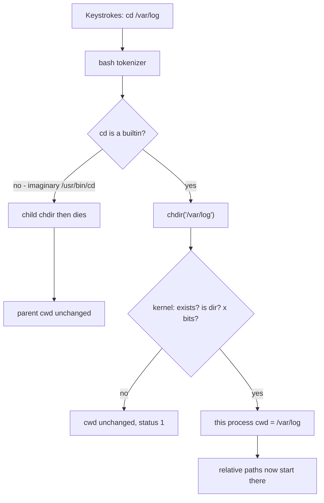

# cd — change directory

## 1. What is it?

`cd` changes **this shell's current working directory** (cwd).

After a successful `cd`, every relative path the shell (and the children it starts) uses is resolved from the new place.

It is a **shell builtin**, not a separate program like `ls`.

## 2. Why does it exist?

Processes need a default "from here" so humans can type `ls` instead of `ls /the/entire/path/every/time`. Unix chose a per-process cwd. `cd` is how the shell updates its own.

## 3. Why do I need to know this as an SRE?

Because:

- Cron and systemd do not stand where you stand.
- A failed `cd` in a script that continues anyway is how people run `rm` in the wrong tree.
- "It cannot find the config" is often "the service's cwd is `/`."
- You cannot `cd` for another process. Restarting with the right `WorkingDirectory=` is the real fix.

## 4. Real-world analogy

You physically walk into another room. Your next "grab the notebook" means the notebook *in this room*. Your colleague in another room did not move with you. A script is a colleague you sent down the hall — unless you walk *inside that script*.

## 5. How does it work internally?

cwd is kernel state on the process (`task_struct` → `fs_struct` → pwd).

The syscall is `chdir(path)` or `fchdir(fd)`.

Only **this process** changes. Children inherit a *copy* at `fork` time. They do not stay linked.

That is why `cd` cannot be `/usr/bin/cd`:

```text
shell
  └─ fork
       └─ /usr/bin/cd /var/log     # this child chdir's
          exit                     # child dies
shell cwd unchanged
```

A builtin runs *inside* the shell process, so `chdir` sticks.

```text
shell process
  builtin cd /var/log
  chdir("/var/log")   # this process
  PWD=/var/log
```

## 6. Syntax / structure

```bash
cd              # go to $HOME (bash)
cd /var/log     # absolute
cd logs         # relative to cwd
cd ..           # parent
cd ~            # home (shell expands ~)
cd -            # previous directory ($OLDPWD)
cd -- -weird    # directory whose name starts with -
```

Relevant bash options (later): `set -e` makes a failed `cd` abort a script. You want that.

## 7. Basic example

```bash
pwd
cd /var/log
pwd
ls
```

You moved. `ls` now lists `/var/log` because its relative path is `.`.

## 8. Step-by-step execution

Take the example the curriculum insists on: **`cd /var/log`**.

### 8.1 What the shell receives

The terminal sends the bytes `c d space / v a r / l o g newline` to bash.

### 8.2 How the shell interprets it

Bash tokenizes:

- command word: `cd`
- argument: `/var/log`

No glob. No `~`. No `$` expansion.

Bash looks up `cd` in its **builtin** table, not in `$PATH`.

### 8.3 What `cd` is

A C function inside `bash` that will call `chdir`.

### 8.4 Why the shell needs to change directory

So that this process's future relative lookups (`open("syslog")`, `ls`) start at `/var/log`.

### 8.5 What happens to the current working directory

1. Bash may save the current `PWD` into `OLDPWD`.
2. Bash calls `chdir("/var/log")`.
3. Kernel walks `/` → `var` → `log`.
4. Kernel checks that the final inode is a directory.
5. Kernel checks **search (execute) permission** on each component, including `log` itself.
6. On success, the process cwd pointer now refers to that directory inode.
7. Bash sets `PWD=/var/log` (logical).
8. The next prompt may display the new path (if your `PS1` includes `\w`).

### 8.6 How relative paths work after this

`cat syslog` → kernel opens `/var/log/syslog`.

### 8.7 How absolute paths work after this

`cat /etc/os-release` still opens `/etc/os-release`. cwd is ignored. That is the point of `/`.

### 8.8 What happens if the directory does not exist

`chdir` returns `-ENOENT`. Bash prints:

```text
bash: cd: /var/log: No such file or directory
```

**cwd does not change.** `echo $?` is `1`. This is the most important failure rule in the file.

### 8.9 What permissions matter

To `cd` into a directory you need **execute (x)** on it and on every parent. Read (`r`) is needed to *list* it (`ls`), not to *enter* it.

```text
r  — list names
w  — create/delete names (with x)
x  — search / enter / traverse
```

You can `cd` into a directory you cannot `ls`. You can `ls` a directory you cannot `cd` into? No — listing still needs to open it; typically you need `r` and, for some operations, `x`. Week 3 makes this precise. Observe it on Day 4 Ticket C.

### 8.10 How the next command behaves differently

| Command | Before `cd /var/log` (cwd `$HOME`) | After |
| ------- | ---------------------------------- | ----- |
| `pwd` | `/home/you` | `/var/log` |
| `ls` | your home listing | logs |
| `cat syslog` | `$HOME/syslog` (probably missing) | `/var/log/syslog` |
| `ls /etc` | `/etc` | `/etc` (absolute, unchanged) |

## 9. Why would I use this?

- Interactive exploration
- A script that must operate in a known tree (still prefer absolute paths *after* a guarded `cd`, or skip `cd` entirely)
- `cd -` to flip between two incident locations (`/etc/nginx` and `/var/log/nginx`)

## 10. When should I NOT use it?

- In one-liners you will paste into cron (`cd foo && ./bin` is better than hoping cwd)
- To "fix" a running service — you cannot `cd` another pid
- As a substitute for putting the right path in the application config
- `cd` without checking success in a script that then destroys files

## 11. Alternative ways

| Approach | What it does |
| -------- | ------------ |
| `cd /var/log` | Change cwd |
| `pushd /var/log` / `popd` | Directory stack; good when hopping |
| `ls /var/log` | Do not move; ask about that path |
| `cat /var/log/syslog` | Absolute; cwd irrelevant |
| systemd `WorkingDirectory=` | Service cwd |
| `docker exec -w /var/log` | Start with that cwd |
| subshell `(cd /var/log && ls)` | Change cwd only inside the subshell |

## 12. Comparison

| Approach | Purpose | Advantages | Disadvantages | When to use |
| -------- | ------- | ---------- | ------------- | ----------- |
| `cd PATH` | Move this shell | Simple | Easy to forget you moved | Interactive |
| `pushd`/`popd` | Stack | Return cheaply | People don't know the stack | Multi-dir incidents |
| Absolute commands | Never move | Safest | Verbose | Scripts, cron, runbooks |
| Subshell `(cd ... && cmd)` | Temporary move | Does not pollute parent | Easy to lose vars | Makefiles, one-off |
| `WorkingDirectory=` | Service home | Survives restart | Hidden if you only SSH | Long-running apps |

## 13. Common mistakes

1. Thinking a script's `cd` moves *your* interactive shell.
2. Thinking a new SSH session continues where the last one left off.
3. `cd /var/log` failing silently in a script without `set -e`, then running `rm -rf *`.
4. `cd ~` in cron — `~` may not expand depending on how cron invokes the command.
5. `cd $DIR` unquoted when `$DIR` has a space.
6. `cd` into a symlink and being surprised by `..`.
7. Using `cd` as proof the directory exists in production checkouts — `set -euo pipefail` plus an explicit test is clearer.

## 14. Troubleshooting

### Problem: `cd` says permission denied

Parents or the target lack `x`. `namei -l /the/path` or `ls -ld` each component.

### Problem: `cd` in a script "doesn't work" when you run the script

It *did* work — in the child process. You wanted `. ./script.sh` (source) or you wanted the script to do the real work after `cd`, not to move *you*.

### Problem: `cd` succeeds but `ls` is empty

You are in the right-named, wrong-place directory (`/var/log` vs `/opt/app/log`), or files are hidden (`ls -a`), or you are in a different mount namespace.

### Diagnose this (write answers in your log, not here)

```text
A teammate's prompt is still $HOME after running ./gotologs.sh
The script contains only: cd /var/log
What happened?
```

## 15. Production relevance

Classic outage:

```bash
#!/bin/bash
cd /var/log/myapp
rm -rf *.log
```

`/var/log/myapp` was missing after a new image. `cd` failed. `rm -rf *.log` ran in `/` or in the previous cwd (depending on how it was started). With a sloppy glob or a `rm -rf *`, you now have a much worse incident.

Fix pattern:

```bash
#!/bin/bash
set -euo pipefail
cd /var/log/myapp || exit 1
rm -f -- *.log
```

Better: `rm -f -- /var/log/myapp/*.log` and skip `cd`.

## 16. Security considerations

- `cd` into world-writable directories and running `./tool` is how you execute someone else's binary (`.` in `PATH` is worse).
- Do not `cd /` and experiment as root.
- Directory names starting with `-` need `cd -- "$name"`.

## 17. Performance considerations

`chdir` is cheap. The cost is *wrongness*, not CPU. In hot code, repeated `chdir` across threads is a footgun (cwd is process-global, not per thread on Linux — actually cwd is shared among threads!). Multi-threaded programs should prefer `openat` and avoid `chdir`. That is why serious servers take absolute paths.

## 18. Related concepts

```text
cd
 ↓
filesystem / FHS
 ↓
paths (absolute vs relative)
 ↓
permissions (x on directories)
 ↓
processes (cwd is per process; inherit on fork)
 ↓
shell (builtin vs external)
 ↓
environment (PWD, OLDPWD, HOME)
 ↓
cron / systemd WorkingDirectory
```

## 19. Visual diagram

```text
Shell (bash, pid 2201)
  |
  |  you type: cd /var/log
  v
Builtin cd
  |
  |  syscall chdir("/var/log")
  v
Kernel
  walk / → var → log
  check dir + execute bits
  |
  +-- fail → cwd unchanged, exit 1
  |
  +-- ok → cwd becomes /var/log
              |
              v
         /var/log
              |
              ├── syslog
              ├── auth.log
              └── nginx/
```



## 20. Hands-on exercise

Do this exactly. Write `pwd` after every step.

```bash
pwd
cd /var/log
pwd
ls
cd ..
pwd
cd
pwd
cd -
pwd
cd /this/path/should/not/exist
echo "status=$?"
pwd
```

Then prove the builtin vs process point:

```bash
pwd
bash -c 'cd /var/log; pwd'
pwd
```

The outer `pwd` did not move. The inner bash did, then died.

## 21. Mini challenge

Without looking back:

1. Why is `cd` a builtin?
2. After a failed `cd`, where are you?
3. Write a two-line script that deletes logs in `/var/log/myapp` *safely* (the directory might be missing).
4. Why is `(cd /var/log && grep Error syslog)` sometimes better than `cd /var/log` then `grep` in an incident shell you still need?

Answers are not in this file. Day 7 / the mentor will grade them.

## 22. Interview questions

**Beginner**

- What does `cd` do?
- What is the difference between `cd /var/log` and `cd var/log`?

**Intermediate**

- Why can't `cd` be implemented as a standalone executable?
- What do `cd`, `cd ~`, and `cd -` do?
- You run a script that `cd`s. Your prompt does not move. Why?

**Advanced**

- How does cwd interact with threads?
- How do containers and `chroot` change what `cd /` means?
- A process is in a deleted directory. How do you see that and why `df` may still show used space?

## 23. SRE scenario

02:00. Checkout latency 200ms → 5s. CPU 30%. Database connections 95%. You SSH to an app host to inspect logs.

You `cd /var/log/myapp`. Permission denied. The app user can write here; you cannot. You `sudo -u appuser -s` and `cd` again. The directory is empty. The app was started with `WorkingDirectory=/tmp/myapp` from an old unit file and is logging *there*, filling the `/tmp` tmpfs. Connection pool saturation is a *symptom* of threads stuck writing logs. You already suspected pools from performance testing. Linux cwd told you *where*.

Immediate mitigation: restart the service with the correct working directory / log path, or stop the debug logging. Not `chmod 777`.

## 24. Summary

- `cd` changes **this process only**.
- It is a **builtin** so that can be true.
- Failed `cd` **leaves you where you were**.
- Relative paths follow you. Absolute paths do not care.
- Scripts should `set -e` and prefer absolute paths.
- You cannot `cd` another process; configure its cwd and restart.

## 25. Knowledge checklist

- [ ] I understand what this is
- [ ] I understand why it exists
- [ ] I can explain it
- [ ] I can use it
- [ ] I can troubleshoot it
- [ ] I can explain its alternatives
- [ ] I can apply it in production
- [ ] I can answer interview questions

### Performance-testing bridge

- You already know **context** matters: the same sampler against `/login` vs `/checkout` is a different test.
- cwd is the process's context for files.
- Next: who is allowed to enter the directory — permissions (Week 3).
