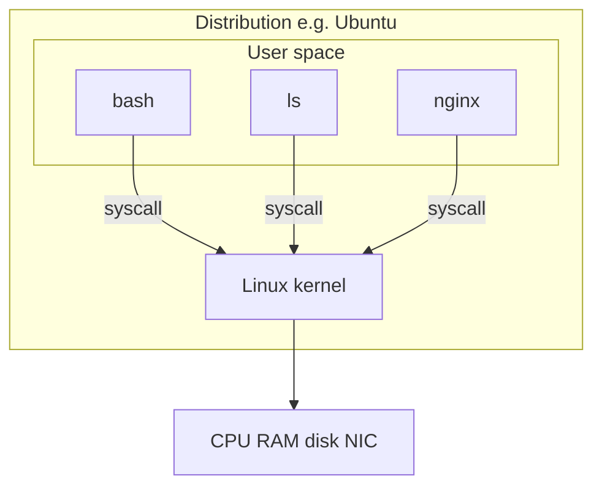

# What is Linux?

## 1. What is it?

Linux is an **operating-system kernel** — a privileged program that owns the hardware and offers processes a safe, usable interface.

In conversation, "Linux" often means a **distribution**: kernel + userland (bash, `ls`, systemd, a package manager) + default configuration. Ubuntu, Amazon Linux, and RHEL are distributions. They share a kernel family. They do not share every tool or path.

## 2. Why does it exist?

Hardware cannot fairly share itself. Programs will overwrite each other's memory, hog the CPU, and write garbage to the disk. A kernel exists to:

- schedule the CPU
- isolate memory
- mediate files and devices
- enforce identity and permissions
- talk to the network stack

Linux exists specifically as a free, clone-like Unix kernel that anyone can run and inspect. That is why it ate servers, phones (Android), containers, and the cloud.

## 3. Why do I need to know this as an SRE?

Almost every production system you will page on is Linux, or is pretending to be (containers are Linux namespaces + cgroups + a filesystem).

If "Linux" is a brand name in your head, you will treat the box as a black appliance. Incidents happen *inside* the appliance.

## 4. Real-world analogy

The kernel is the air-traffic control tower. Airplanes (processes) do not pick runways. They request. The tower can say no.

A distro is the airport: same rules of flight, different restaurants and signage.

## 5. How does it work internally?

On boot, firmware loads a bootloader, which loads the kernel. The kernel:

1. Initializes hardware
2. Mounts an initial filesystem
3. Starts process 1 (`systemd` on most modern servers)
4. Process 1 starts everything else

From then on, user programs run in **unprivileged** CPU mode. To do anything real (read a file, send a packet) they issue a **system call**. The CPU switches into kernel mode, the kernel does or refuses the work, and control returns.

```text
Power
  → firmware
    → bootloader
      → Linux kernel
        → pid 1 (systemd)
          → sshd, cron, your app
```

## 6. Syntax / structure

There is no single "linux command." You interact through:

- a shell (`bash`)
- system calls (hidden under commands)
- virtual files (`/proc`, `/sys`)
- a service manager (`systemd`)

A common identity query:

```bash
uname -s -r -m
# Linux 6.8.0-xx x86_64
```

## 7. Basic example

```bash
cat /etc/os-release
uname -a
```

The first tells you the **distro's opinion** of itself.  
The second tells you the **kernel** you are actually running.

Those can disagree in containers and old AMIs. Always read both during an incident.

## 8. Step-by-step execution

When you run `uname -a`:

1. The terminal delivers characters to the shell.
2. The shell finds `uname` (usually `/usr/bin/uname`) via `$PATH`.
3. The shell `fork`s a child and `exec`s `uname`.
4. `uname` issues the `uname` syscall.
5. The kernel copies name/release/machine strings to the process.
6. `uname` prints them and exits 0.
7. The shell waits, then shows a new prompt.

If `$PATH` is broken, step 2 fails: `command not found` — the kernel never heard the question.

## 9. Why would I use this?

- Confirm you are on the box you think you are (`uname`, `hostname`, `os-release`)
- Know which kernel bugs / features you have
- Know which package manager and init system you have (distro)

## 10. When should I NOT use it?

Do not treat "it's Linux" as a diagnosis. The kernel being up does not mean nginx is up. Do not spend Day 1 compiling a kernel. Do not switch distros to feel productive.

## 11. Alternative ways

| Need | Linux way | Other |
| ---- | --------- | ----- |
| See OS | `/etc/os-release` | Windows `winver` |
| See kernel | `uname -r` | Windows `ver` (not the same) |
| Cloud "what's this box" | IMDS + `os-release` | Console tags |

## 12. Comparison

| Approach | Purpose | Advantages | Disadvantages | When to use |
| -------- | ------- | ---------- | ------------- | ----------- |
| `uname -a` | Kernel identity | Always there | No distro pretty name | Incidents, support tickets |
| `/etc/os-release` | Distro identity | Human fields | Missing on tiny containers | Package questions |
| Console / cloud tags | Inventory | Nice UI | Lies if the AMI drifted | First minute only |

## 13. Common mistakes

- Saying "Linux" when you mean "Ubuntu desktop"
- Assuming `/bin` vs `/usr/bin` layout is identical on every distro
- Assuming the container's `os-release` matches the *host* kernel (`uname -r` is the host's)
- Believing "Linux doesn't crash" (the kernel can; userland crashes daily)

## 14. Troubleshooting

**Problem:** `cat /etc/os-release` says Amazon Linux, `uname -r` looks unfamiliar.

Investigate: are you in a container? Compare `/proc/1/cgroup` and `ps -p 1`. The kernel is shared with the host; the userland is not.

## 15. Production relevance

A "simple" AMI upgrade changes the kernel. A previously harmless `io_uring` or cgroup v1/v2 difference appears as "the same app is slow on the new fleet." You cannot file that ticket if you think Linux is one thing.

## 16. Security considerations

The kernel is the TCB (trusted computing base). Kernel CVEs are class-A incidents. Unprivileged users should not be able to load random modules. Distro choice is a security-support choice (who ships patches?).

## 17. Performance considerations

Kernel version changes scheduler, memory reclaim, and TCP defaults. Your JMeter baseline on kernel A is not automatically valid on kernel B. Treat kernel upgrades like app releases: they need a baseline.

## 18. Related concepts

```text
what is an OS → Linux kernel → user space → process → syscall
       ↓
     distro → systemd → packages
       ↓
     containers (reuse the host kernel)
```

## 19. Visual diagram



## 20. Hands-on exercise

Run and interpret:

```bash
uname -a
cat /etc/os-release
ps -p 1 -o pid,comm,args
```

Write one sentence: is pid 1 `systemd`? If not, what are you on?

## 21. Mini challenge

You `exec` into a container. `cat /etc/os-release` says Alpine. `uname -r` matches the Kubernetes node's Ubuntu kernel. Is that a bug? Explain.

## 22. Interview questions

- **Beginner:** What is the difference between Linux and Ubuntu?
- **Intermediate:** Why can a container see a different distro than `uname -r`?
- **Advanced:** What happens if the kernel panics vs if pid 1 dies?

## 23. SRE scenario

02:10. New nodes in the ASG. Error rate 4%. Old nodes fine. Someone says "same AMI family." You check `uname -r` and it drifted because a latest-kernel package applied. Your next move is not "restart nginx on all boxes."

## 24. Summary

Linux-the-kernel is not Linux-the-distro. You live in user space. You survive by asking the kernel well, and by knowing which of the two you are talking about.

## 25. Knowledge checklist

- [ ] I understand what this is
- [ ] I understand why it exists
- [ ] I can explain it
- [ ] I can use it
- [ ] I can troubleshoot it
- [ ] I can explain its alternatives
- [ ] I can apply it in production
- [ ] I can answer interview questions

### Performance-testing bridge

- You already treat "environment" as a test variable.
- Kernel + distro *are* environment.
- Next: see the boundary — kernel vs user space — as a syscall.
