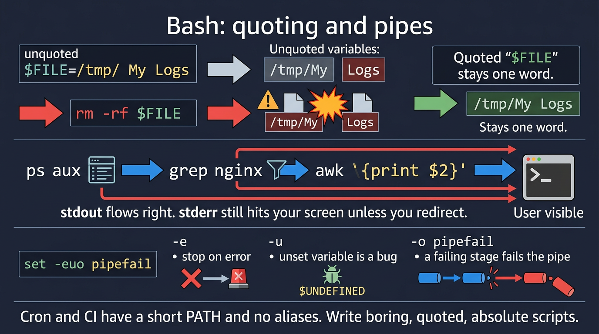

# Visual: Bash essentials — quoting, pipes, exit codes

Full doc: [`../bash/bash-essentials.md`](../bash/bash-essentials.md)



```text
$FILE=/tmp/My Logs
unquoted  →  /tmp/My    Logs     (two words)
quoted    →  /tmp/My Logs        (one word)
cmd1 | cmd2   stdout→stdin;  stderr still your screen
```

## Walk it

**Bash** is the language of the incident. **Quoting** stops word-splitting. **Pipes** connect stdout to stdin. **Exit codes** are how you know it failed. `set -euo pipefail` is the minimum adult script header.

**SRE why:** You will write one-liners under pressure. They must be boring, quoted, and logged. Cron PATH is not your PATH.

## 5-minute lab

```bash
set -euo pipefail
mkdir -p "$HOME/sre-lab/q"
fn='file with spaces'
touch "$HOME/sre-lab/q/$fn"
ls -l "$HOME/sre-lab/q/$fn"
# compare: ls $HOME/sre-lab/q/$fn   # may break — see it, then stop
```

## Check yourself

Write a one-liner that deletes logs only in /var/log/myapp and fails closed if the directory is missing.
