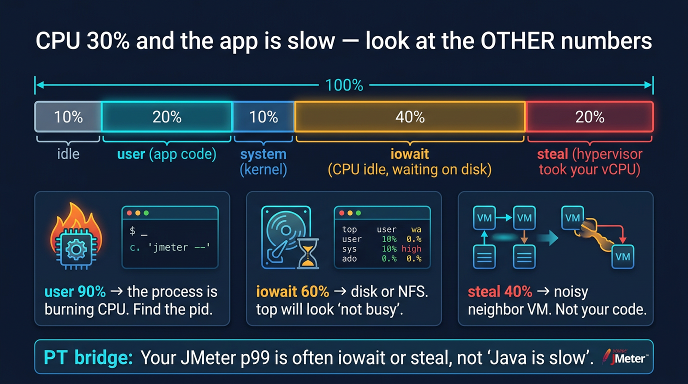

# Visual: CPU saturation — user, system, iowait, steal

Full doc: [`../cpu/cpu-saturation.md`](../cpu/cpu-saturation.md)



```text
%Cpu  us 30  sy 10  wa 50  st 5  id 5
         │        │       │
        app     kernel   disk wait
```

## Walk it

CPU time is split. **user**: app code. **system**: kernel. **iowait**: idle, waiting on I/O. **steal**: the hypervisor ran someone else. **idle**: truly nothing to do. Saturation means a queue — not just 'percent high'.

**SRE why:** Your JMeter p99 often *is* iowait or steal. Adding app replicas will not fix a saturated disk or a noisy neighbor.

## 5-minute lab

```bash
vmstat 1 5
# write the us/sy/wa/st you saw and one sentence of meaning
```

## Check yourself

CPU us=15 wa=0 st=45. Latency 10x. What is your first hypothesis?
