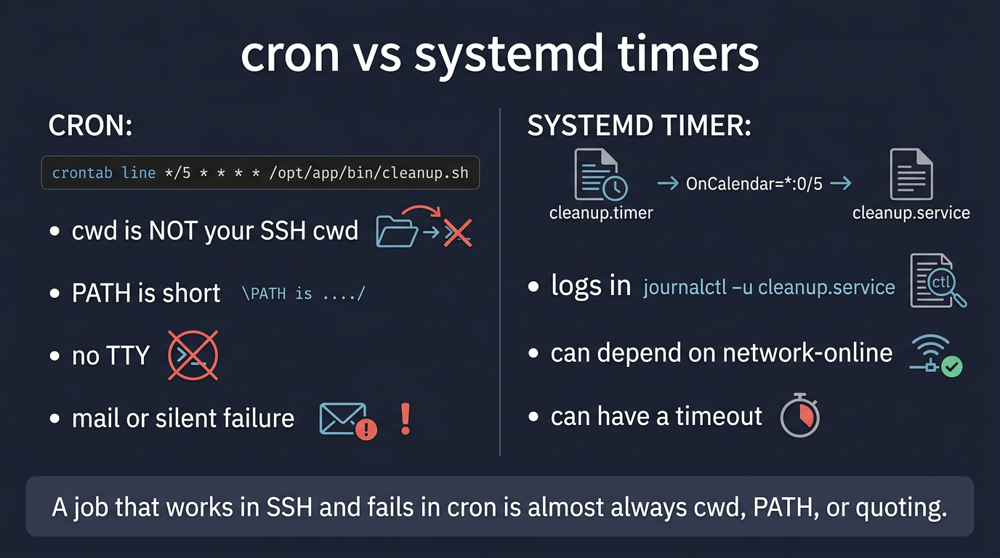

# Visual: cron vs systemd timers

Full doc: [`../systemd/cron-and-timers.md`](../systemd/cron-and-timers.md)



```text
cron   */5 * * * *  /abs/script   →  tiny PATH, cwd=home
timer  cleanup.timer → cleanup.service → journalctl -u cleanup
```

## Walk it

**cron** runs a command on a calendar (`*/5 * * * *`). **systemd timers** trigger a `.service` on a calendar or after boot. Both fail in the same ways: cwd, PATH, no TTY, silent errors.

**SRE why:** A job that works in SSH and fails in cron is cwd/PATH/quoting. Prefer timers if you want journals and dependencies. Prefer cron if that is what the box already has — but make it boring and logged.

## 5-minute lab

```bash
crontab -l 2>/dev/null || true
systemctl list-timers --all | head
# write a one-liner you would trust: absolute path + redirected logs
```

## Check yourself

Cron: `cd /var/log/myapp && rm *.log`. It deleted something in $HOME. Why?
