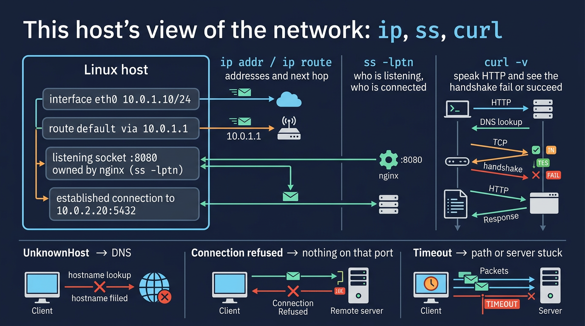

# Visual: This host's network — ip, ss, curl

Full doc: [`../networking/ip-ss-curl.md`](../networking/ip-ss-curl.md)



```text
curl -v URL
  DNS  →  TCP connect  →  TLS  →  HTTP
           ▲
           ss -lptn  (is anything bound?)
```

## Walk it

**`ip`** shows addresses and routes. **`ss`** shows sockets (who listens, who is connected). **`curl`** speaks HTTP(S) and shows the handshake. Together they are the Linux-side of 'is it DNS, TCP, TLS, or HTTP?'

**SRE why:** Before you blame the app: `ss -lptn` (is it listening?), `ip route` (is there a path?), `curl -v` (where does it die?).

## 5-minute lab

```bash
ip -br addr
ip route | head
ss -lptn | head
curl -sv --max-time 5 https://example.com -o /dev/null
```

## Check yourself

ss shows nginx on 127.0.0.1:80 only. The ALB health check fails from the subnet. What is wrong?
