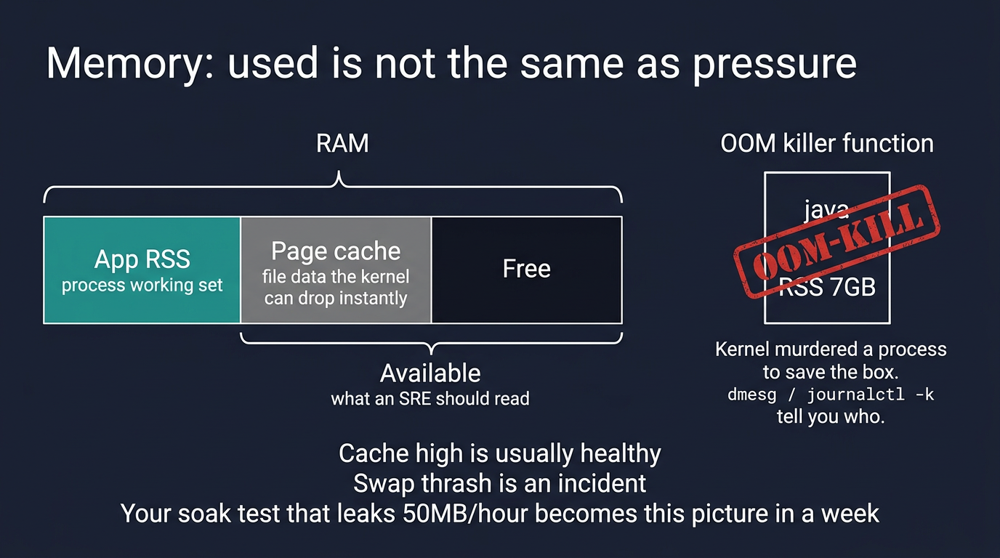

# Visual: Memory — RSS, cache, available, OOM

Full doc: [`../memory/memory.md`](../memory/memory.md)



```text
RAM: [ RSS apps | page cache (droppable) | free ]
                └──────── available ──────────┘
If available → 0 and reclaim fails → OOM killer
```

## Walk it

**RSS** is a process's resident pages. **Page cache** is file data the kernel keeps and can drop instantly. **Available** (from `free -h`) is what an SRE should read — it includes reclaimable cache. **OOM killer** is the kernel murdering a process to keep the box alive.

**SRE why:** Linux using 95% of RAM with huge cache is often *healthy*. OOM is not. `dmesg`/`journalctl -k` names the victim. A leak shows as RSS climbing across a soak — your home turf.

## 5-minute lab

```bash
free -h
ps aux --sort=-%mem | head -8
grep -i oom /var/log/kern.log 2>/dev/null | tail || journalctl -k | grep -i oom | tail
```

## Check yourself

free says used 92%, available 8 GB, cache 40 GB. Is the host in trouble? Why?
