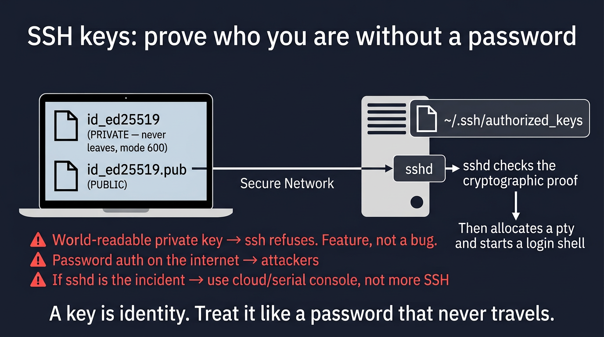

# Visual: SSH — keys, agent, hardening intro

Full doc: [`../ssh/ssh.md`](../ssh/ssh.md)



```text
laptop private key ──challenge──► sshd ──authorized_keys (public)
                                      │
                                      └── pty → login shell
```

## Walk it

**SSH** is an encrypted login and command channel. **Keys** prove identity: a private file you never copy, a public file you place in `authorized_keys`. `sshd` is the server. If sshd is the incident, you need a console.

**SRE why:** Key-only auth, no root login, jump/bastion, `ssh-agent`. Permissions: `~/.ssh` 700, private key 600, authorized_keys 600. ssh will refuse sloppy modes — that is a feature.

## 5-minute lab

```bash
ls -la ~/.ssh 2>/dev/null || true
# if a private key exists: stat -c '%a %n' ~/.ssh/* 2>/dev/null | head
man ssh | col -b | head -5
```

## Check yourself

ssh says 'UNPROTECTED PRIVATE KEY FILE'. What mode is wrong, and why is ssh correct to refuse?
