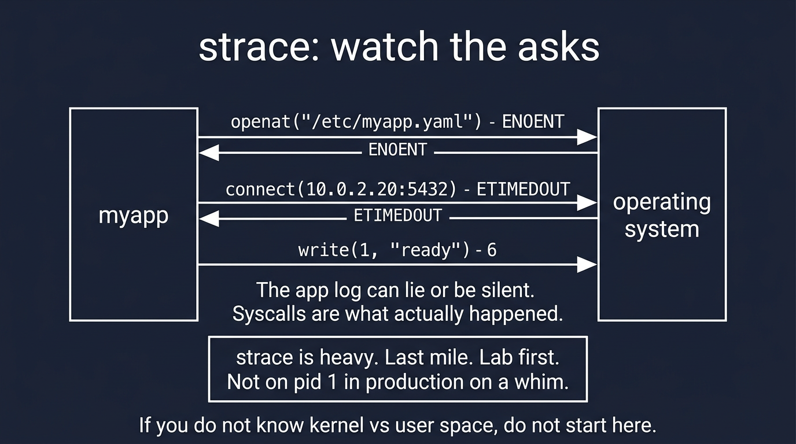

# Visual: strace — last-mile syscalls

Full doc: [`../troubleshooting/strace-intro.md`](../troubleshooting/strace-intro.md)



```text
myapp  --openat("/etc/myapp.yaml")-->  ENOENT
       --connect(10.0.2.20:5432)-->   ETIMEDOUT
```

## Walk it

**strace** prints the system calls a process makes: `openat`, `connect`, `write`, and the errno. It is how you see the asks when logs lie.

**SRE why:** Use it when you already know the pid and the layer. 'It cannot find the config' → strace and watch `openat`. 'It hangs' → last syscall is `connect` to the DB.

## 5-minute lab

```bash
strace -e openat cat /etc/os-release >/dev/null
strace -e openat cat /no/such 2>&1 | tail
```

## Check yourself

strace shows connect to 10.0.2.20:5432 hanging. Logs say 'starting'. What is H1, and what is *not* your next command?
