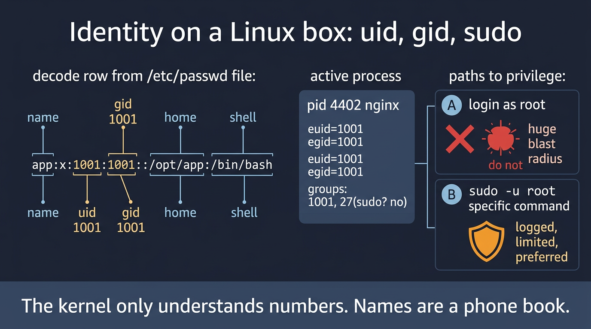

# Visual: sudo vs logging in as root

Full doc: [`../users-permissions/sudo-intro.md`](../users-permissions/sudo-intro.md)



```text
you ──sudo──► policy check ──► exec as root or -u app
                 │
                 └── syslog / journal  'sudo: you : CMD'
```

## Walk it

**sudo** lets a permitted user run a *specific* command as another user (often root), with a log line. Logging in as root is an unbounded session as uid 0.

**SRE why:** You will `sudo systemctl restart` and `sudo journalctl -xe`. You will not `sudo -i` and wander. A bad sudoers line can lock out every admin.

## 5-minute lab

```bash
sudo -l
id
sudo -u nobody id
# if you have no sudo, write that fact — it is data
```

## Check yourself

You can reproduce a write failure only as the app user. Write the exact sudo command. Why is `sudo -i` the wrong move?
