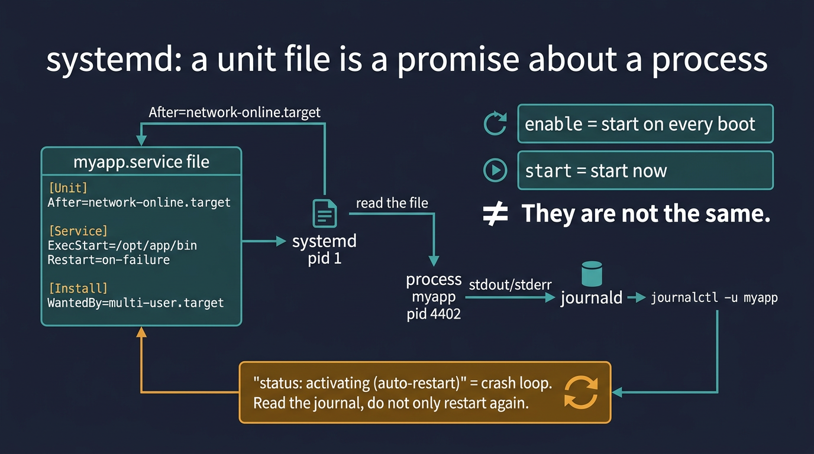

# Visual: systemd units — start, enable, restart

Full doc: [`../systemd/systemd.md`](../systemd/systemd.md)



```text
myapp.service  →  systemd (pid 1)  →  myapp pid
       │                                  │
    enable@boot                      stdout → journald
```

## Walk it

**systemd** is pid 1 on most servers. A **unit** (`.service`, `.timer`, `.socket`) is a file that declares how to start, stop, and depend on something. **start** means now. **enable** means at boot. They are not the same.

**SRE why:** `systemctl status UNIT` is the first command on a 'service is down' ticket. `Restart=on-failure` plus a crash is a crash loop — read the journal, do not only restart again.

## 5-minute lab

```bash
systemctl status ssh || systemctl status sshd
systemctl cat ssh 2>/dev/null || systemctl cat sshd | head -30
systemctl is-enabled ssh 2>/dev/null || systemctl is-enabled sshd
```

## Check yourself

After reboot the app is down. systemctl status says disabled. What was forgotten, and how do you tell start from enable?
