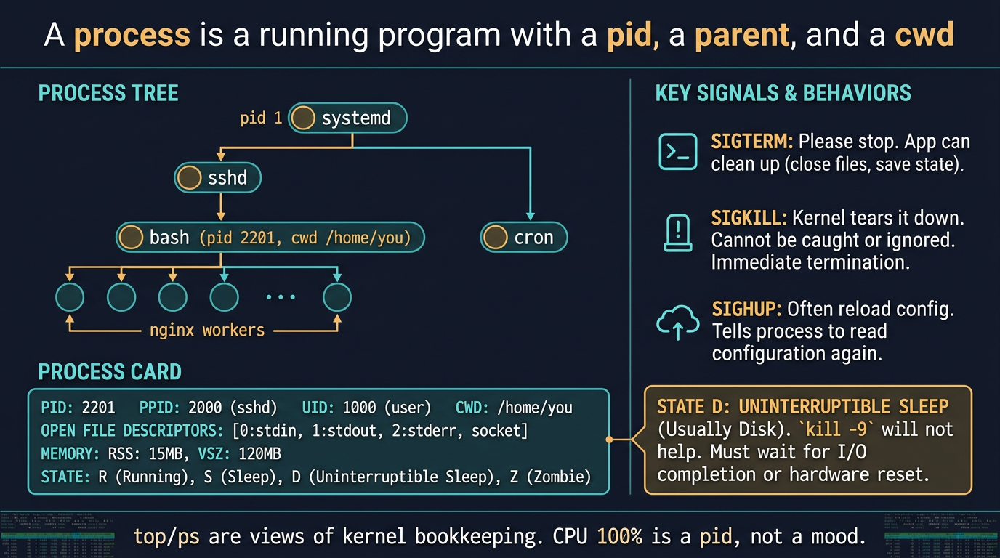

# Visual: What a process is

Full doc: [`../processes/what-is-a-process.md`](../processes/what-is-a-process.md)



```text
pid 1 systemd
  └─ sshd
       └─ bash  pid 2201  cwd=/home/you  uid=you
            └─ ps
```

## Walk it

A **process** is a running program: an address space, a pid, a parent, credentials, a cwd, file descriptors, and a state. It is not the binary on disk. The binary is just bytes until `exec`.

**SRE why:** Every incident bottoms out as 'which pid, what is it waiting on, what uid, what cwd, what fds?' If you cannot answer those, you only restart.

## 5-minute lab

```bash
ps -p $$ -o pid,ppid,uid,user,stat,cmd
readlink /proc/$$/cwd
ls /proc/$$/fd
cat /proc/$$/status | egrep 'Name|Pid|PPid|Uid|State'
```

## Check yourself

Is `cd` changing a file or a field on the process? Draw it.
