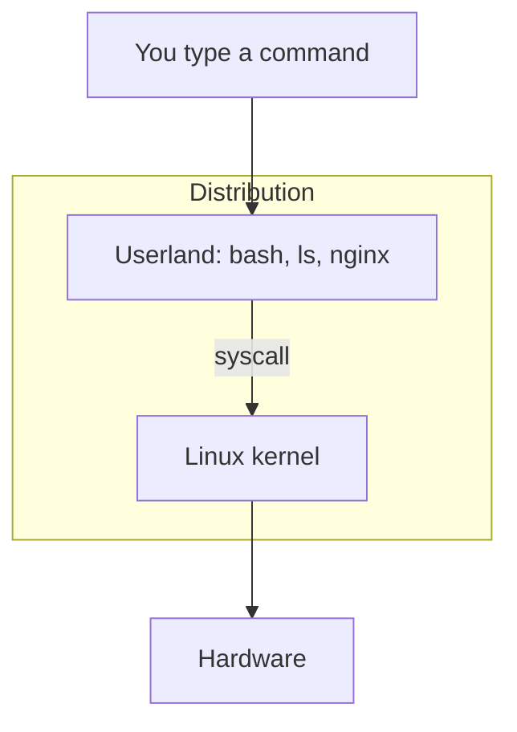

# Visual: what "Linux" actually points at

Full prose: [`../../../fundamentals/what-is-linux.md`](../../../fundamentals/what-is-linux.md)

## The picture

```text
┌──────────────────────────────────────────────────────────┐
│  Ubuntu / Amazon Linux / RHEL     ← a DISTRIBUTION       │
│  (installer, packages, default configs, opinions)        │
│                                                          │
│   ┌──────────────────────────────────────────────────┐   │
│   │  GNU userland                                    │   │
│   │  bash   ls   coreutils   systemd   apt/yum       │   │
│   │                                                  │   │
│   │    ┌────────────────────────────────────────┐    │   │
│   │    │  Linux KERNEL                          │    │   │
│   │    │  schedules CPU, owns memory,           │    │   │
│   │    │  mediates files, enforces permissions  │    │   │
│   │    └────────────────────────────────────────┘    │   │
│   └──────────────────────────────────────────────────┘   │
└──────────────────────────────────────────────────────────┘
                         │
                         v
              CPU   RAM   disk   NIC
```



## Walk the diagram

1. **Hardware** cannot share itself fairly. That is why an OS exists.
2. The **kernel** is the only program allowed to touch devices directly.
3. **Userland** is everything you actually type: `ls`, nginx, JMeter if you installed it here.
4. A **distro** is kernel + userland + opinions. Ubuntu and Amazon Linux share a kernel *family*. They do not share every path.

## Performance-testing bridge

You already treat "environment" as a test variable.  
Kernel version + distro **are** environment. A baseline on kernel A is not automatically valid on kernel B.

## Check yourself

Close the page. Draw the three nested boxes from memory. If you wrote "Linux = Ubuntu", redraw.
