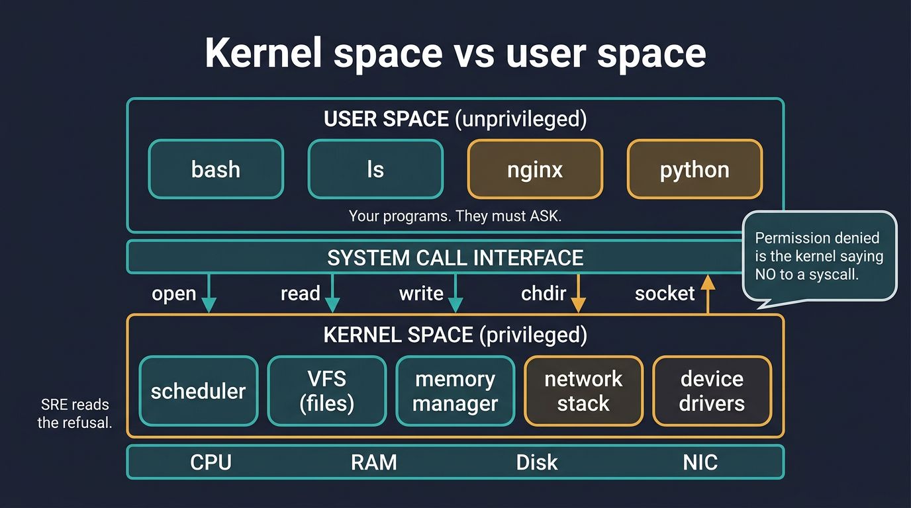
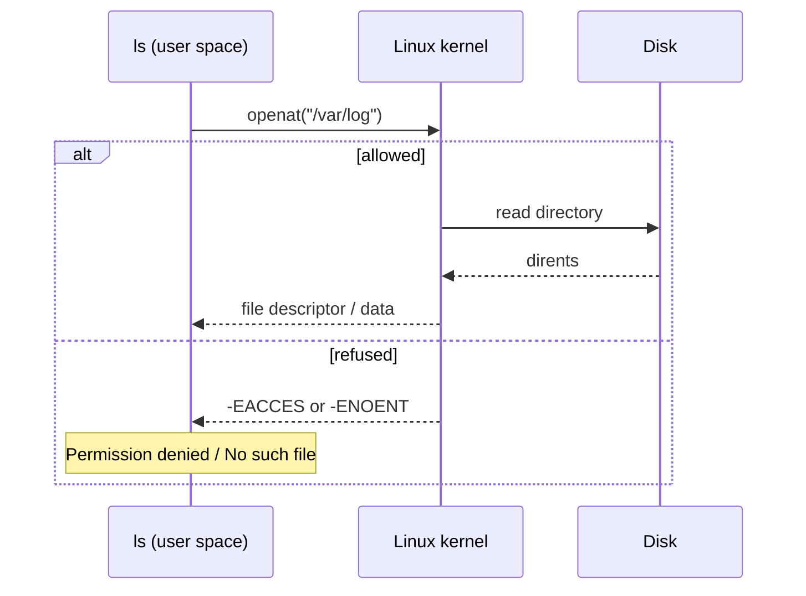

# Visual: kernel vs user space

Full prose: [`../../../fundamentals/kernel-vs-user-space.md`](../../../fundamentals/kernel-vs-user-space.md)

## The picture

## Walk the diagram

1. `bash`, `ls`, `nginx`, `python` live in **user space**. They are unprivileged.
2. To do anything real they issue a **system call** (`open`, `read`, `write`, `chdir`, `socket`).
3. The **kernel** checks identity and arguments, then talks to hardware.
4. `Permission denied` is not the shell being rude. It is the kernel returning **no**.
5. SRE work is often **reading that no** (wrong user, missing file, full disk, bad path).

## What each box is for

| Box | Job | If it is sick |
| --- | --- | ------------- |
| User programs | Your service | Crash, leak, 500s |
| Syscall interface | The asking protocol | App sees errno |
| Scheduler | Who runs on CPU | Load, latency |
| VFS | Files as a single tree | ENOENT, EACCES |
| Memory manager | RAM, reclaim, OOM | OOM killer |
| Network stack | Packets | Timeouts, resets |
| Drivers | Hardware | `dmesg` horrors |

## Performance-testing bridge

The CPU / disk / memory graphs you already watch are **kernel counters**.  
A "slow response" is often a **blocked syscall**, not "Java is tired."

## Check yourself

Name three syscalls you already triggered today and what "no" would look like for each.
