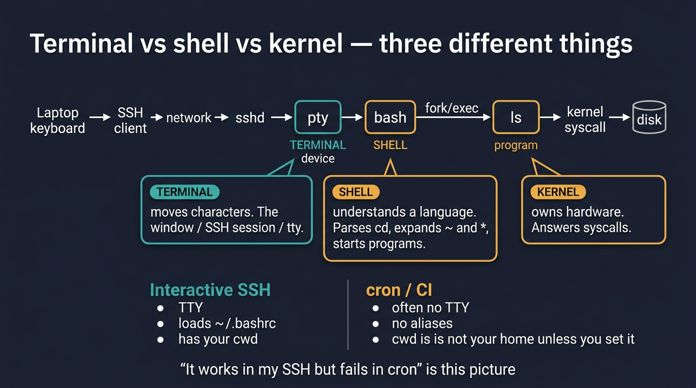
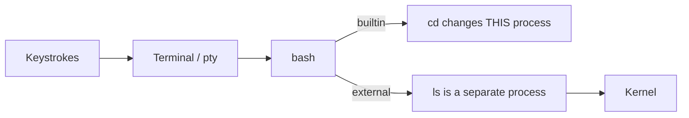

# Visual: terminal vs shell vs kernel

Full prose: [`../../../fundamentals/shell-vs-terminal.md`](../../../fundamentals/shell-vs-terminal.md)

## The picture



```text
 keyboard
    │
    v
 SSH client ──network──► sshd ──► pty  (TERMINAL: moves characters)
                           │
                           v
                         bash          (SHELL: understands a language)
                           │  fork/exec
                           v
                          ls           (a program)
                           │  syscall
                           v
                        kernel
```



## Walk the diagram

| Word | What it is | If it is missing |
| ---- | ---------- | ---------------- |
| Terminal | A device that moves characters (window, SSH, serial console) | You type into nothing |
| Shell | A program that parses language and starts others | You have a TTY and no useful interpreter |
| Kernel | Owns the machine | Nothing runs |

Three hidden differences that cause incidents:

1. **Interactive bash** reads `~/.bashrc`. **Cron** usually does not.
2. **`~` and `*`** are expanded by the **shell**, not the kernel.
3. **`cd` is a builtin** so it can change *this* process. `ls` is usually an external binary.

## The cron picture

```text
Your SSH session          cron / GitHub Actions
────────────────          ─────────────────────
has a TTY                 often no TTY
cwd = wherever you cd'd   cwd = $HOME of that user, or /
PATH includes extras      PATH is short
aliases work              aliases do not
```

"It works when I type it" is this table.

## Check yourself

Why can `ls` be `/usr/bin/ls` but `cd` cannot be `/usr/bin/cd`? Draw the fork.
