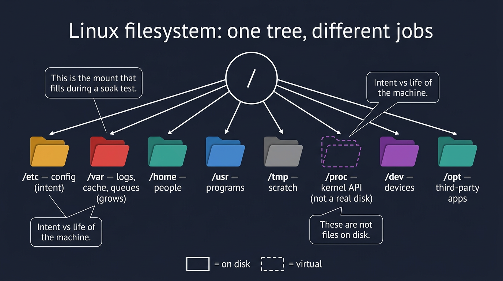
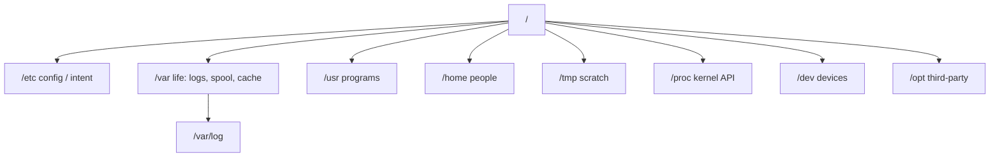

# Visual: Filesystem Hierarchy Standard

Full prose: [`../../../filesystem/filesystem-hierarchy.md`](../../../filesystem/filesystem-hierarchy.md)

## The picture



```text
                         /
         ┌─────┬─────┬───┴───┬─────┬─────┬─────┐
       etc   var   usr    home   tmp   proc  dev
        │     │                      (virtual)
      nginx  log
              │
           syslog     ← this GROWS
```



## Walk the diagram

| Path | Kind | Grows? | You edit? |
| ---- | ---- | ------ | --------- |
| `/etc` | Intent (config) | no | carefully |
| `/var` | Life of the machine | **yes** | rarely by hand |
| `/usr` | Programs | via packages | no |
| `/home` | Humans | yes | yes |
| `/tmp` | Scratch | yes, often wiped | yes |
| `/proc` | Kernel dressed as files | virtual | read; knobs only |
| `/dev` | Device nodes | virtual-ish | special |

The SRE instinct:

- Something is "full" → **which branch / which mount grew?**
- Config "didn't apply" → **which file did the process actually read?**
- "Check the logs" → **which directory, which unit, which permission?**

## Performance-testing bridge

A soak that writes 2 GB of debug logs per hour is a capacity plan for **`/var`** (or the container writable layer), not for "CPU."

## Check yourself

`df -h /` is 38%. The app cannot write `/var/log/app.log`. Draw two mounts that make that possible.
