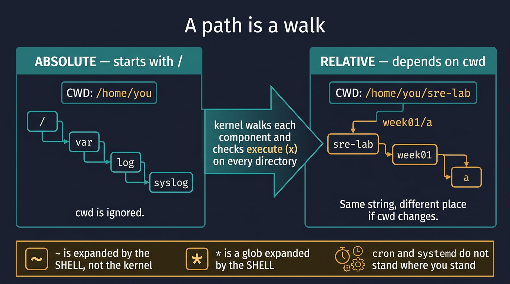
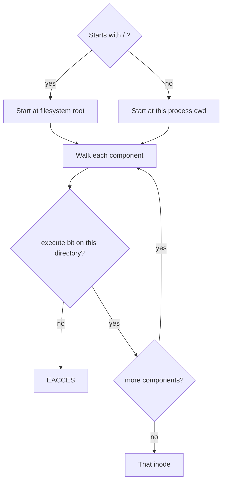

# Visual: paths

Full prose: [`../../../filesystem/paths.md`](../../../filesystem/paths.md)

## The picture



```text
cwd = /home/you/sre-lab

relative "week01/a"
        ──walk──►  /home/you/sre-lab/week01/a

absolute "/var/log"
        ──walk──►  /var/log
        (cwd ignored)

~         expanded by SHELL to $HOME, then walked
*.log     expanded by SHELL to a list of names
```



## Walk the diagram

1. A path is a **walk**, not a label floating in space.
2. `/` at the front = start at root. Anything else = start at **this process's cwd**.
3. Each directory on the walk needs **execute (x)** — that means "search / enter."
4. `~` and `*` never reach the kernel. The shell rewrites them first.
5. Cron, systemd, and CI do not stand where your SSH session stands. **Automation speaks absolute paths.**

## Three strings that lie

| You typed | Who rewrites it | Danger |
| --------- | --------------- | ------ |
| `~/app` | shell | cron may not expand `~` |
| `*.log` | shell | if nothing matches, the literal `*.log` may be passed |
| `../app.log` | nobody | depends entirely on cwd |

## Check yourself

A cron line is `cat error.log`. You are in `/var/log/nginx` when you test it by hand and it works. Why does cron fail? Draw cwd for both.
