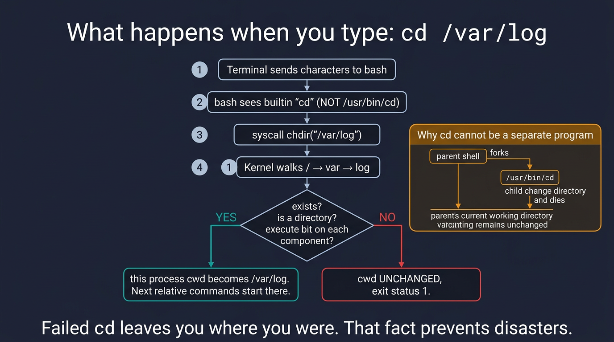
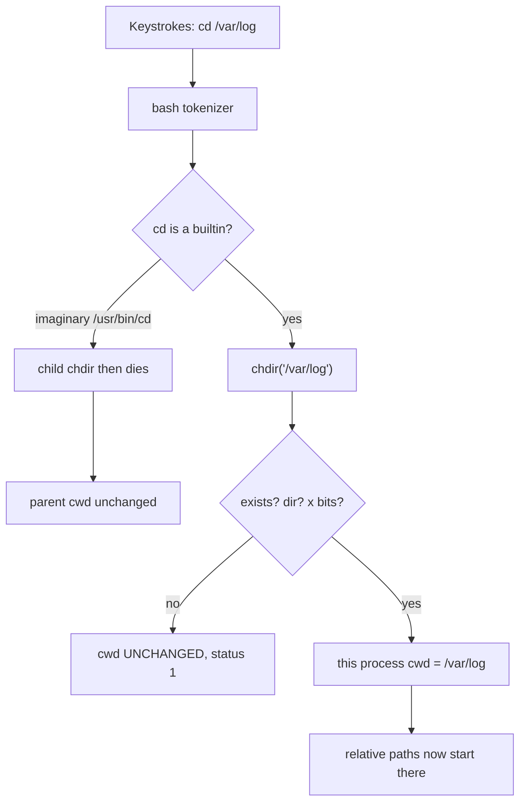

# Visual: `pwd`, `ls`, `cd`

Full prose: [`../../../commands/pwd.md`](../../../commands/pwd.md) · [`../../../commands/ls.md`](../../../commands/ls.md) · [`../../../commands/cd.md`](../../../commands/cd.md)

## The picture — `cd /var/log`





## Walk `cd`

1. The terminal only moves characters.
2. bash sees a **builtin**, so `chdir` runs **inside this process**.
3. The kernel walks `/` → `var` → `log` and checks **x** on each.
4. Success → cwd pointer moves. Failure → **you do not move**. `$?` is 1.
5. A script's `cd` cannot move *your* interactive shell. Different process.

## Walk `pwd`

```text
Process bash
  kernel cwd ──► inode of /var/log
  PWD="/var/log"     (logical, shell memory)
  pwd -P             (physical, resolve symlinks)
```

Failed `cd` does not change either.

## Walk `ls`

```text
ls -l /var/log     →  list CHILDREN of that directory
ls -ld /var/log    →  describe the directory inode itself
ls -la             →  include names starting with .
```

Dotfiles are a **convention of `ls`**, not a kernel hide.

## Comparison

| Approach | Moves you? | Best for |
| -------- | ---------- | -------- |
| `cd /var/log` then `ls` | yes | Interactive hopping |
| `ls /var/log` | no | Asking without moving |
| `cat /var/log/syslog` | no | Scripts, cron, runbooks |
| `(cd /var/log && grep Error syslog)` | only inside subshell | Incident shell you still need |

## Check yourself

Draw why `./gotologs.sh` containing only `cd /var/log` does not move your prompt.
