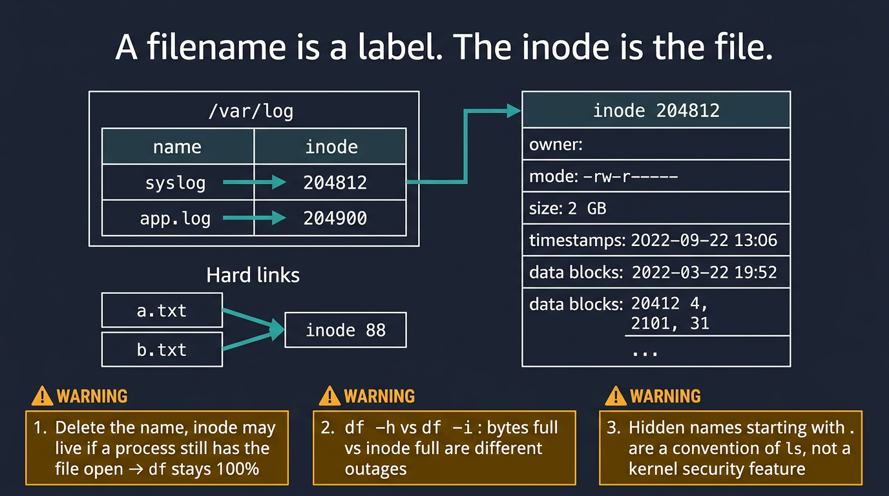
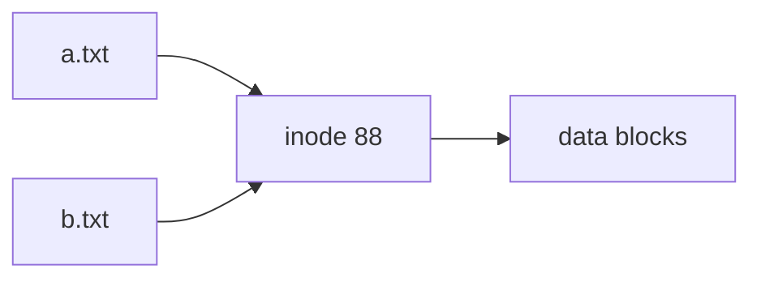
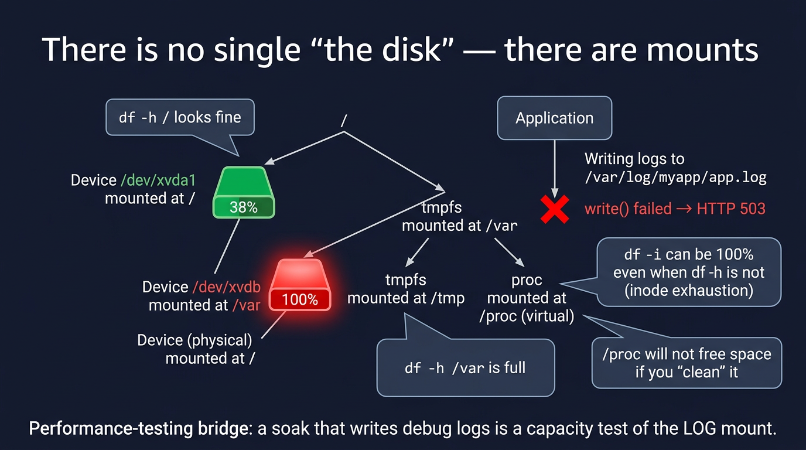
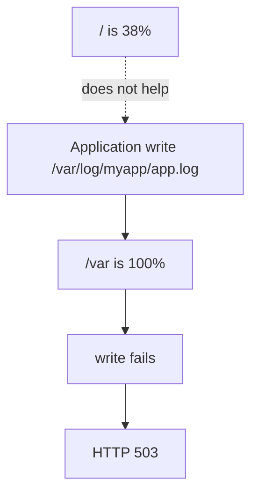

# Visual: inodes and mounts

Taught on Day 5. Deeper standalone docs arrive in Week 06.

## Picture 1 — name vs inode



```text
Directory /var/log
  name "syslog"  ──► inode 204812
                       ├── owner, mode, size, times
                       └── data blocks (the bytes)

Delete the name:
  if a process still has the file open →
  inode lives → df still says 100%
```



Two names, one file: a **hard link**. Edit one, the other changes. That is the proof that the name is not the file.

## Picture 2 — mounts



```text
 /dev/xvda1  ──mounted on──►  /      38%   "disk is fine"
 /dev/xvdb   ──mounted on──►  /var  100%   app cannot write logs
 tmpfs       ──mounted on──►  /tmp
 proc        ──mounted on──►  /proc   (not a disk)
```



## Walk both pictures

1. `df -h` reports **mounts**, not "the computer."
2. `df -i` reports **inode** exhaustion. Millions of tiny files can fill inodes while bytes look free.
3. `/proc` will not free space if you "clean" it. It is not on disk.
4. Deleted-but-open files are why `du` and `df` disagree. Month 2 will drill this.

## Performance-testing bridge

Your soak test's log volume is a capacity plan for **one mount**.  
APM can look fine until `write()` fails. Then you get 503s and a "flaky host."

## Check yourself

Write the first five commands you would run at 02:00 when "disk is 100%" — in order — and why that order.
