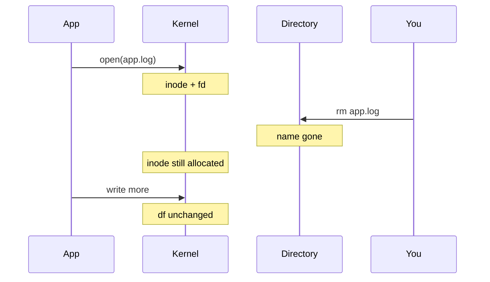

# Week 02 — visual explainers

**Theme:** Files, text, finding things, editors

Diagram-first. Full 25-section docs are written when the week opens.

## Concept 1: Files vs names vs inodes (revisit)

A name is a label on an inode. `rm` removes a name.

## Concept 2: `touch` / `mkdir` / `cp` / `mv` / `rm`

Create, copy, move, remove — and what `rm` does not do to an open file.

## Concept 3: `cat` / `less` / `head` / `tail` / `tail -f`

How an SRE actually reads logs.

## Concept 4: Globs and `find`

The shell expands `*`. `find` walks the tree.

## Concept 5: Editors enough to survive (`nano`, `vi` basics)

You must edit a file on a box with no IDE.


## Concept: `rm` does not always free disk

```text
process ──holds fd──► inode 204900 (app.log, 40 GB)
you: rm /var/log/app.log
name is gone
inode LIVES until the process closes or dies
df still 100%
```



**PT bridge:** a soak with debug logs + log rotation that only unlinks names will look like “rotation is broken.”


## Performance-testing bridge

Whatever this week names (files, perms, CPU, disk, packets) is something you already *saw from the outside* in a load test. The picture here is how that number is born.

## Check yourself

Close the page. Redraw one diagram from memory. If you cannot, you watched, you did not learn.
