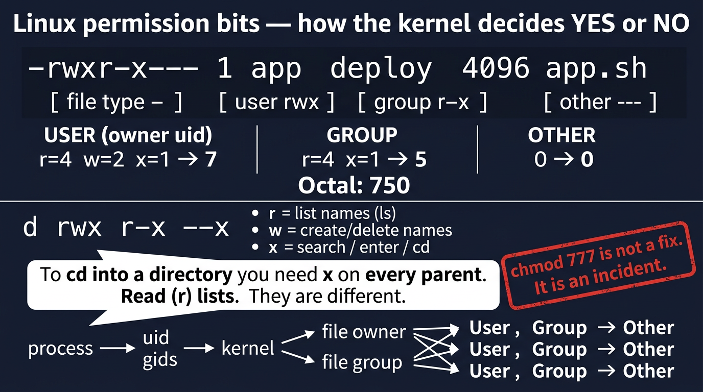
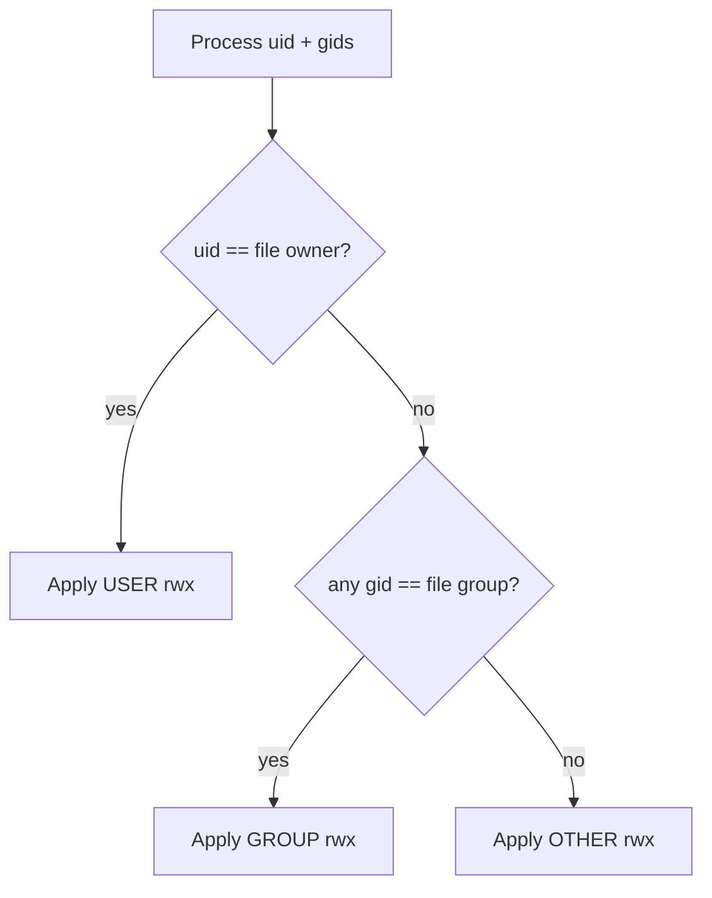

# Visual: permission bits



## The string

```text
-rwxr-x---  1 app deploy  4096  app.sh
│││││││││
││││││││└─ other  x?  no
│││││││└── other  w?  no
││││││└─── other  r?  no
│││││└──── group  x?  yes
││││└───── group  w?  no
│││└────── group  r?  yes
││└─────── user   x?  yes
│└──────── user   w?  yes
└───────── user   r?  yes   and leading - means regular file
```

Octal: user 7 (`rwx`) + group 5 (`r-x`) + other 0 = **750**

## Directory bits are a different job

```text
r on a directory  →  list names (ls)
w on a directory  →  create / delete names
x on a directory  →  enter / search / cd / traverse
```

You can `cd` into a directory you cannot `ls`.  
You cannot `cd` into a directory without `x`, even if you can see the name from the parent.

## How the kernel chooses a triad



## SRE rule

`chmod 777` is not a mitigation. It is a new incident.

Full week resources: [`../resources.md`](../resources.md)
