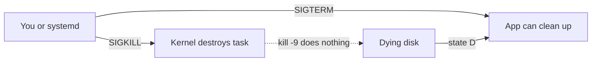

# Visual: processes and signals


```text
pid 1  systemd
  ├─ sshd
  │    └─ bash   pid 2201   cwd=/home/you   uid=you
  │         └─ the command you just typed
  └─ your app
       └─ worker threads  (same pid on Linux unless they are processes)
```

A process card always has:

| Field | Why SRE cares |
| ----- | ------------- |
| pid | What you kill, what you `ls /proc/PID` |
| ppid | Who will reap it |
| uid | Permissions |
| cwd | Relative paths, log locations |
| fds | “Too many open files” |
| state | `R` running, `S` sleep, `D` disk, `Z` zombie |

## Signals



Full week resources: [`../resources.md`](../resources.md)
