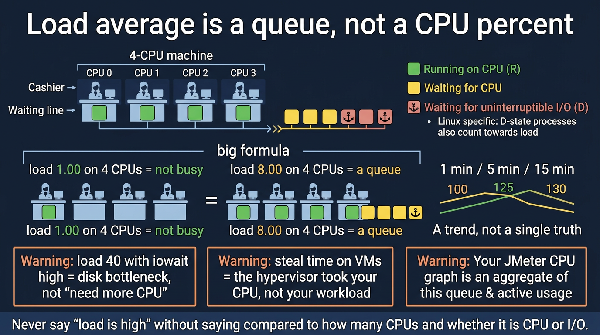

# Week 05 — visual explainers

Image: [images/load-average.png](images/load-average.png)

**Theme:** CPU, memory, /proc, load average

Diagram-first. Full 25-section docs are written when the week opens.

## Concept 1: Load average

A queue length, not a CPU percent.

## Concept 2: CPU vs iowait vs steal

Three different ‘busy’ stories.

## Concept 3: RSS vs cache vs available

Cache is not ‘used up’ the way Windows Task Manager implied.

## Concept 4: `/proc` as an API

The kernel answering questions dressed as files.

## Concept 5: OOM

The kernel murdered a process to save the box.


## Concept: load average is a line at the cashiers



```text
4 CPUs
load 1.0  → plenty of idle cashiers
load 4.0  → all cashiers busy, no line
load 8.0  → a line of 4 waiting

Linux also counts tasks in D (disk wait) in the load number.
High load + high iowait ≠ buy more CPU.
```


## Performance-testing bridge

Whatever this week names (files, perms, CPU, disk, packets) is something you already *saw from the outside* in a load test. The picture here is how that number is born.

## Check yourself

Close the page. Redraw one diagram from memory. If you cannot, you watched, you did not learn.
