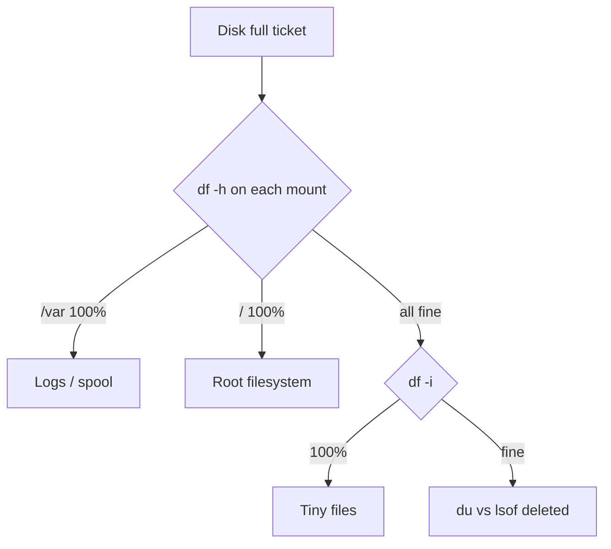

# Week 06 — visual explainers

**Theme:** Disk, filesystems, inodes, I/O

Diagram-first. Full 25-section docs are written when the week opens.

## Concept 1: `df` vs `du`

Mount usage vs directory walk. They can disagree.

## Concept 2: Inode exhaustion

`df -i` at 100% with `df -h` healthy.

## Concept 3: Deleted-but-open files

The soak-test log you `rm`'d is still filling the disk.

## Concept 4: I/O wait

The CPU is idle *because* the disk is not.

## Concept 5: Mounts / fstab idea

A path is a stitch between trees.


## Concept: three different “full”

```text
df -h  100%   →  bytes on that mount
df -i  100%   →  no more inodes (too many tiny files)
du << df      →  deleted-but-open, or a mount hiding a full directory
```




## Performance-testing bridge

Whatever this week names (files, perms, CPU, disk, packets) is something you already *saw from the outside* in a load test. The picture here is how that number is born.

## Check yourself

Close the page. Redraw one diagram from memory. If you cannot, you watched, you did not learn.
