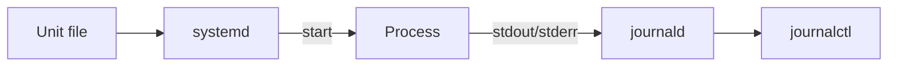

# Week 07 — visual explainers

**Theme:** systemd, journals, cron, time

Diagram-first. Full 25-section docs are written when the week opens.

## Concept 1: Units

A service is a file plus a process the manager watches.

## Concept 2: enable vs start

Now vs every boot.

## Concept 3: `journalctl`

The first place logs live on modern distros.

## Concept 4: cron vs timers

Two schedulers. Know which one you actually have.

## Concept 5: Time drift

TLS and logs lie when the clock is wrong.


## Concept: unit → process → journal

```text
/etc/systemd/system/myapp.service
        │
        v
 systemd (pid 1) ──starts──► myapp pid 4402
        │
        v
 journald ──► journalctl -u myapp.service
```




## Performance-testing bridge

Whatever this week names (files, perms, CPU, disk, packets) is something you already *saw from the outside* in a load test. The picture here is how that number is born.

## Check yourself

Close the page. Redraw one diagram from memory. If you cannot, you watched, you did not learn.
