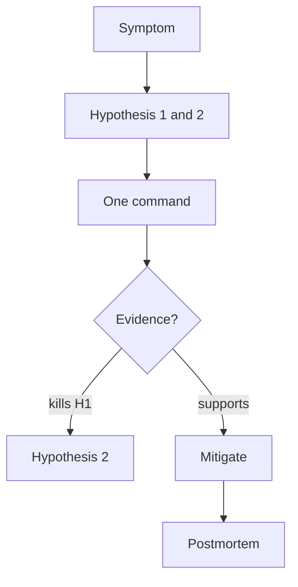

# Week 09 — visual explainers

**Theme:** Linux troubleshooting method

Diagram-first. Full 25-section docs are written when the week opens.

## Concept 1: Observe → hypothesize → test

Random commands are not a method.

## Concept 2: What layer is sick?

CPU, mem, disk, net, perms, config, dependency.

## Concept 3: `strace` intro

Last-mile: the syscalls the process is actually issuing.

## Concept 4: Resource exhaustion playbook

Full disk, OOM, fd limit, load.

## Concept 5: Write a postmortem of a drill

If you only restarted it, the exercise failed.


## Concept: the four questions

```text
1. What do I see?
2. What do I believe is true?
3. How would I falsify that?
4. What is the smallest next command?
```




## Performance-testing bridge

Whatever this week names (files, perms, CPU, disk, packets) is something you already *saw from the outside* in a load test. The picture here is how that number is born.

## Check yourself

Close the page. Redraw one diagram from memory. If you cannot, you watched, you did not learn.
