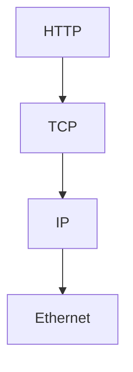

# Week 11 — visual explainers

Dedicated page: [layers.md](layers.md)

**Theme:** Networking first principles, OSI / TCP-IP

Diagram-first. Full 25-section docs are written when the week opens.

## Concept 1: Why networks exist for an SRE

A 503 has a layer.

## Concept 2: OSI vs TCP/IP

Maps, not religion.

## Concept 3: Encapsulation

HTTP in TCP in IP in Ethernet.

## Concept 4: Interfaces

A name (`eth0`) plus addresses.

## Concept 5: JMeter errors are layered

`UnknownHost` ≠ `Connection refused` ≠ timeout.


## Concept: an error is a layer

```text
JMeter / browser
    │
    ├─ UnknownHostException        → DNS
    ├─ Connection refused          → nothing listening (TCP)
    ├─ Timeout                     → drop / filter / stuck server
    ├─ TLS handshake fail          → cert / SNI / clock
    └─ HTTP 503                    → app or upstream
```



Do not say “the site is down.” Say which layer died.


## Performance-testing bridge

Whatever this week names (files, perms, CPU, disk, packets) is something you already *saw from the outside* in a load test. The picture here is how that number is born.

## Check yourself

Close the page. Redraw one diagram from memory. If you cannot, you watched, you did not learn.
