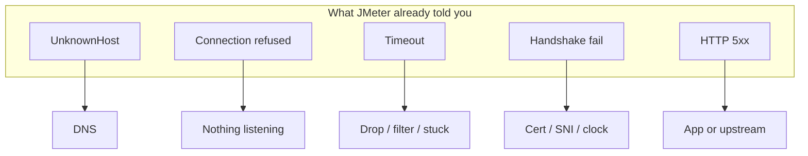

# Visual: a request is layers

```text
You / JMeter
    │  HTTP GET /checkout
    v
┌──────────── Application ────────────┐
│  HTTP method, path, status          │
└────────────────┬────────────────────┘
                 │ inside
┌──────────── Transport ──────────────┐
│  TCP ports, handshake, resets       │
└────────────────┬────────────────────┘
                 │ inside
┌──────────── Internet ───────────────┐
│  IP addresses, routing              │
└────────────────┬────────────────────┘
                 │ inside
┌──────────── Link ───────────────────┐
│  MAC, Ethernet, local segment       │
└─────────────────────────────────────┘
```



**Do not say “the site is down.” Say which layer died.**

Resources (including free Cisco badge): [`../resources.md`](../resources.md)
