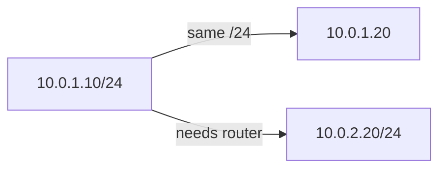

# Week 12 — visual explainers

Dedicated page: [cidr.md](cidr.md)

**Theme:** IPv4, subnetting, CIDR

Diagram-first. Full 25-section docs are written when the week opens.

## Concept 1: Address + mask

The mask decides who is local.

## Concept 2: `/24` `/16` `/32`

How many hosts, how many networks.

## Concept 3: Gateway

The first hop off this network.

## Concept 4: Route table row

If there is no route, there is no conversation.

## Concept 5: Why VPC week needs this

AWS networking is this picture with extra names.


## Concept: the mask cuts the address

```text
10.0.1.50/24

network  10.0.1.0
hosts    .1 … .254
broadcast .255
router   often .1

10.0.2.0/24 is ANOTHER network.
No route → no talk.
```



Go slowly. Future VPC, SG, and Kubernetes Service CIDRs all sit on this week.


## Performance-testing bridge

Whatever this week names (files, perms, CPU, disk, packets) is something you already *saw from the outside* in a load test. The picture here is how that number is born.

## Check yourself

Close the page. Redraw one diagram from memory. If you cannot, you watched, you did not learn.
