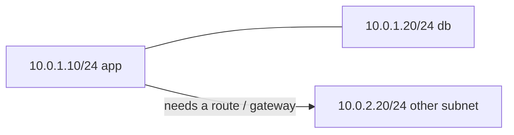

# Visual: CIDR / subnetting

```text
10.0.1.50/24

address  00001010.00000000.00000001.00110010
mask /24 11111111.11111111.11111111.00000000
                     network ────────┘└─ hosts

network   10.0.1.0
first     10.0.1.1      (often the router)
this host 10.0.1.50
last      10.0.1.254
broadcast 10.0.1.255
```



| Prefix | Hosts (typical IPv4) | Mental model |
| ------ | -------------------- | ------------ |
| /32 | 1 | This exact address |
| /24 | ~254 | A small LAN / a VPC subnet |
| /16 | ~65k | Too big to think of as “a LAN” |
| /0 | everything | Default route |

Your future **VPC**, **security group**, and **Kubernetes Service CIDR** are this picture with cloud names.

Go slowly. Resources: [`../resources.md`](../resources.md)
