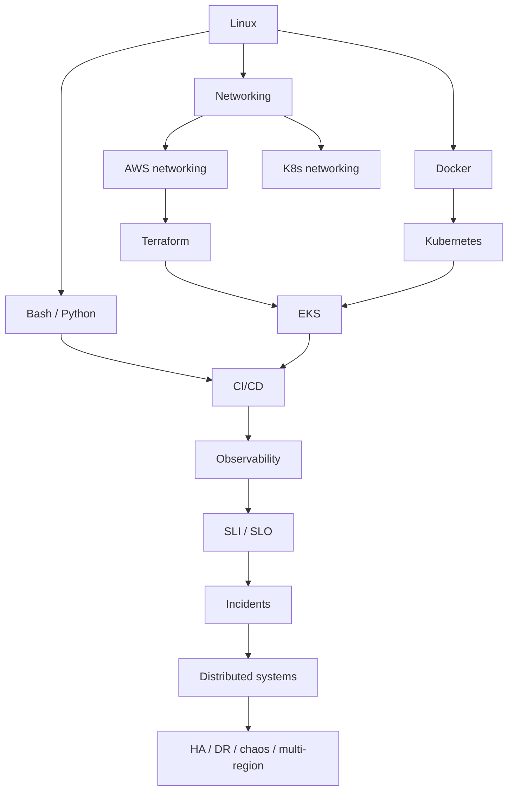

# Ten phases

Phases overlap on purpose. SRE thinking starts in orientation. Formal SRE *module* waits until you can measure a system you built.

```text
P1 Foundation        M1–M6     Linux, net, git, bash, python, SE
P2 Infrastructure    M7–M11    AWS, Terraform, security, deeper Linux admin
P3 Containers        M12–M13   Docker, container net/sec/debug
P4 Kubernetes        M14–M18   K8s + EKS
P5 CI/CD             M19–M20   GitHub Actions, deploy strategies, GitOps
P6 Observability     M21–M23   Metrics, logs, traces, Prom, Grafana, Splunk, AppD, OTel
P7 SRE               M22–M24   SLI/SLO/SLA, error budgets, toil, ownership
P8 Incidents         M24–M25   On-call, IC, postmortems
P9 Distributed       M26–M27   Consistency, queues, DBs, cache, messaging
P10 Advanced + job   M28–M31   Perf, capacity, HA, DR, chaos, multi-region, interviews
```

## Phase gates (must pass to wear the badge)

| Phase | Gate |
| ----- | ---- |
| 1 | Foundation exam + portfolio **v1** |
| 2 | AWS + Terraform exam + portfolio **v3/v4** |
| 3 | Docker exam + portfolio **v2** (often done just before the AWS versions settle) |
| 4 | Kubernetes + EKS exam + portfolio **v5** |
| 5 | Pipeline + rollback drill + portfolio **v6** |
| 6 | Three-pillar observability exam + portfolio **v7–v9** |
| 7 | Write SLIs/SLOs + error-budget policy for the portfolio |
| 8 | Live incident simulation + postmortem |
| 9 | Design review of a distributed failure |
| 10 | Chaos + DR exercise + interview panel + career checklist |

v2 Docker is *built* in Phase 3 even if the phase-2 cloud versions already exist; the portfolio is allowed to fork briefly, then merge.

## Why this order



Kubernetes before Linux networking is how people get stuck typing YAML they cannot debug.

Observability before SLOs is how people create dashboards nobody pages off.

Distributed-systems trivia before you have run a queue in anger is how people recite CAP and still cannot explain their own 503s.

## Hours (planning only)

| Phase | Months | ~Hours at 12h/week |
| ----- | -----: | -----------------: |
| 1 | 6 | 310 |
| 2 | 5 | 260 |
| 3 | 2 | 105 |
| 4 | 5 | 260 |
| 5 | 2 | 105 |
| 6–8 | 5 | 260 |
| 9 | 2 | 105 |
| 10 | 4 | 210 |
| **Total** | **31** | **~1615** |

This is a working professional's budget. It is enough for Level 4 if we do not waste it on tool tourism.
